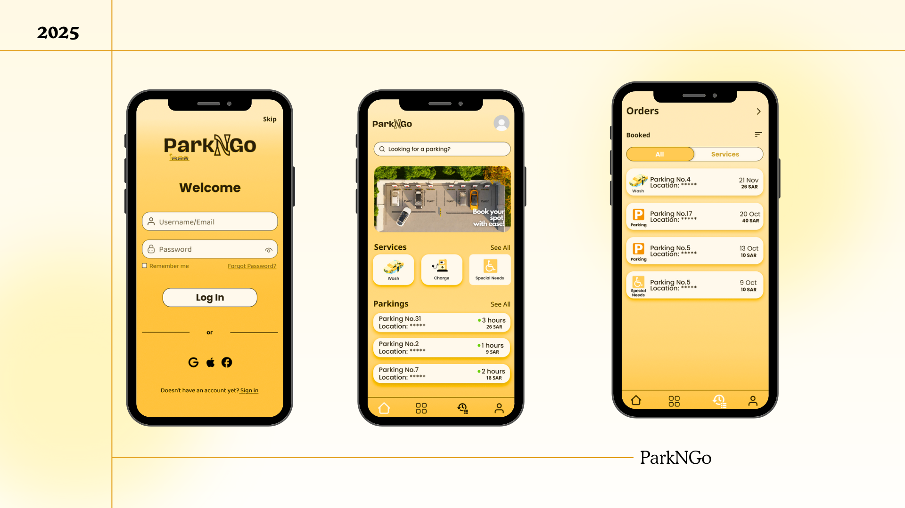

# 🚗 ParkNGo – First UI/UX Prototype

**ParkNGo** is my first UI/UX prototype, designed using **Figma** as part of my participation in a workshop organized by **TEKnology**. The idea was originally inspired by a project I worked on for the **Principals Software Engineering Principles** course at university.

## 🔗 View the Prototype
👉 [Click here to open the ParkNGo design in Figma](https://www.figma.com/design/C8OONTOH1aRRBSV0TO03QT/ParkNGo?node-id=0-1&t=4JjIDRWN5gbvE0vN-1)

## 📷 Preview

